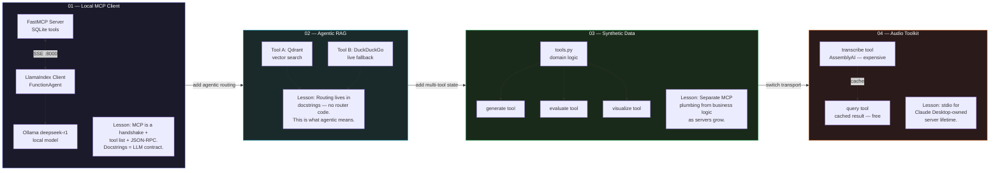

<!-- ████████████████████████████████  HEADER  ████████████████████████████████ -->

<div align="center">


</div>

<!-- ████████████████████████████████  TYPING  ████████████████████████████████ -->

<div align="center">

[](https://git.io/typing-svg)

</div>

<br/>

<!-- ████████████████████████████████  BADGES  ████████████████████████████████ -->

<div align="center">

[](https://python.org)
[](https://github.com/jlowin/fastmcp)
[](https://modelcontextprotocol.io)
[](https://claude.ai/download)
[](https://cursor.sh)
[](.)
[](.)

</div>

<br/>

---

<!-- ████████████████████████████████  ABOUT  ████████████████████████████████ -->

## 🔌 What is MCP — and Why Build Servers?

```python
class MCPServersLearningPath:
    def __init__(self):
        self.protocol   = "Model Context Protocol — open standard by Anthropic"
        self.analogy    = "USB for AI agents — one interface, any capability"
        self.author     = "Krishna Nagpal — AI Engineer @ TeenyTechTrek"
        self.host_types = ["Claude Desktop", "Cursor", "Custom LlamaIndex Agent"]
        self.transports = ["SSE (Server-Sent Events)", "stdio (child process)"]

    @property
    def why_build_not_just_use(self):
        return [
            "Forces clear thinking about tool boundaries",
            "Schema design and docstring-driven routing",
            "Understanding how an LLM decides which tool to call",
            "Transport trade-offs: SSE vs stdio",
            "Separating MCP plumbing from domain logic",
        ]

    @property
    def concepts_covered(self):
        return {
            "01" : "Discovery · tool list · JSON-RPC · docstrings as contracts",
            "02" : "Agentic routing via descriptions · no router code",
            "03" : "Multi-tool state · clean architecture · testability",
            "04" : "stdio transport · Claude Desktop · expensive-setup pattern",
        }
```

> MCP is just a handshake, a tool list, and JSON-RPC calls. Building both sides of the protocol — server **and** client — is where the real understanding comes from. Every project here exists to drive one concept home.

---

<!-- ████████████████████████████████  PROJECTS  ████████████████████████████████ -->

## 🚀 The Four Projects

<div align="center">

| # | Project | Tools / Libraries | Transport | MCP Host |
|:---:|:---|:---|:---:|:---|
| 01 | [`01-local-mcp-client`](#01--local-mcp-client--your-first-end-to-end-mcp-loop) | FastMCP · SQLite · LlamaIndex `FunctionAgent` · Ollama `deepseek-r1` | SSE `:8000` | Custom LlamaIndex CLI client |
| 02 | [`02-agentic-rag-mcp`](#02--agentic-rag-mcp--docstring-driven-routing) | FastMCP · Qdrant (in-memory) · sentence-transformers · DuckDuckGo | SSE `:8080` | Cursor / bundled `test_client.py` |
| 03 | [`03-synthetic-data-generator`](#03--synthetic-data-generator--multi-tool-with-shared-state) | FastMCP · SDV `HMASynthesizer` · pandas · plotly | SSE `:8090` | Cursor |
| 04 | [`04-audio-analysis-toolkit`](#04--audio-analysis-toolkit--claude-desktop-via-stdio) | FastMCP · AssemblyAI SDK · python-dotenv | **stdio** | Claude Desktop |

</div>

---

<!-- ████████████████████████████████  PIPELINE  ████████████████████████████████ -->

## 🔁 Learning Progression



---

<!-- ████████████████████████████████  PROJECT 01  ████████████████████████████████ -->

## 📦 01 — Local MCP Client · Your First End-to-End MCP Loop

<div align="center">

[](.)
[](.)
[](.)

</div>

You build **both** sides of the protocol: a FastMCP server that exposes simple SQLite tools, and a custom LlamaIndex client that discovers those tools, hands them to a `FunctionAgent`, and lets a local Ollama model call them.

```
FastMCP Server (server.py)        LlamaIndex Client (client.py)
  └─ SQLite tools exposed    ←→    └─ FunctionAgent
       via SSE :8000                    └─ Ollama deepseek-r1 (local)
```

**What you learn:** There is no magic. MCP is a handshake, a tool list, and JSON-RPC calls. Tool docstrings become the contract the LLM reads — write them badly, and the agent calls the wrong tool or passes wrong arguments.

---

<!-- ████████████████████████████████  PROJECT 02  ████████████████████████████████ -->

## 📦 02 — Agentic RAG MCP · Docstring-Driven Routing

<div align="center">

[](.)
[](.)
[](.)

</div>

The server now has **two tools**: a local Qdrant vector search and a live DuckDuckGo fallback. The host LLM has to choose between them on every query. There is no router code anywhere — the routing logic lives entirely in the docstrings.

```python
@mcp.tool()
def search_knowledge_base(query: str) -> str:
    """Search the local vector store for relevant documents.
    USE THIS TOOL WHEN the query is about internal documentation,
    previously ingested knowledge, or domain-specific content.
    Prefer this over web search for factual recall tasks."""
    ...

@mcp.tool()
def search_web(query: str) -> str:
    """Search the live web via DuckDuckGo.
    USE THIS TOOL WHEN the query requires current information,
    recent events, or when the knowledge base returns no results."""
    ...
```

A bundled `test_client.py` (MCP Python SDK) lets you debug the server without involving an LLM at all.

**What you learn:** This is the first time you *feel* why MCP is called "agentic" — the LLM is doing genuine routing, and you wrote the routing logic in plain English.

---

<!-- ████████████████████████████████  PROJECT 03  ████████████████████████████████ -->

## 📦 03 — Synthetic Data Generator · Multi-Tool with Shared State

<div align="center">

[](.)
[](.)
[](.)

</div>

Three tools — `generate`, `evaluate`, `visualize` — that operate on the **same dataset** and have a clear call order. Business logic lives in a separate `tools.py` module; the FastMCP wrappers stay one-liners.

```
server.py (MCP plumbing — thin wrappers)
    └─ @mcp.tool() generate()   → calls tools.generate_data()
    └─ @mcp.tool() evaluate()   → calls tools.evaluate_quality()
    └─ @mcp.tool() visualize()  → calls tools.create_visualization()

tools.py (domain logic — testable, importable, MCP-agnostic)
    └─ HMASynthesizer (SDV)
    └─ pandas quality checks
    └─ plotly figure generation
```

**What you learn:** As servers grow, separating MCP plumbing from domain logic is what keeps them maintainable and testable. The tools.py module is independently importable — no MCP dependency required to unit-test it.

---

<!-- ████████████████████████████████  PROJECT 04  ████████████████████████████████ -->

## 📦 04 — Audio Analysis Toolkit · Claude Desktop via stdio

<div align="center">

[](.)
[](.)
[](.)

</div>

The transport switches from SSE to **stdio** — the server is launched directly by Claude Desktop as a child process. Two tools demonstrate the **expensive setup + cheap follow-up** pattern:

```python
_transcript_cache = {}   # module-level global — persists for server lifetime

@mcp.tool()
def transcribe_audio(file_path: str) -> str:
    """Run AssemblyAI transcription. EXPENSIVE — one API call per file.
    Results cached in memory for the session."""
    result = assemblyai.Transcriber().transcribe(file_path)
    _transcript_cache[file_path] = result.text
    return result.text

@mcp.tool()
def query_transcript(file_path: str, question: str) -> str:
    """Answer a question about a previously transcribed file.
    FREE — reads from in-memory cache. Always call transcribe_audio first."""
    transcript = _transcript_cache.get(file_path, "")
    # slice + return relevant section
```

**What you learn:** Pick your transport based on who owns the server's lifetime. Design tools that complement each other across a multi-turn conversation — the "expensive once, query many times" pattern is fundamental to agentic tool design.

---

<!-- ████████████████████████████████  CONCEPTS  ████████████████████████████████ -->

## 🧠 MCP Concepts Covered

<div align="center">

| Concept | Where it appears |
|:---|:---|
| **Tool discovery** — how a host learns what a server can do | Project 01 |
| **Docstrings as contracts** — the LLM reads your docstring, not your code | Projects 01–04 |
| **JSON-RPC over SSE** — the wire format underneath MCP | Projects 01–03 |
| **Docstring-driven routing** — no router code, routing in plain English | Project 02 |
| **Multi-tool orchestration** — tools with a natural call order | Projects 02–04 |
| **Server-side state** — caching across turns in a single session | Project 04 |
| **SSE transport** — host connects to a long-lived server process | Projects 01–03 |
| **stdio transport** — host spawns server as a child process | Project 04 |
| **Custom agent host** — building your own MCP client from scratch | Project 01 |
| **IDE integration (Cursor)** — wiring an SSE server into an IDE agent | Projects 02–03 |
| **Desktop app integration** — `claude_desktop_config.json` pattern | Project 04 |
| **Separation of concerns** — MCP plumbing vs domain logic | Project 03 |

</div>

---

<!-- ████████████████████████████████  STRUCTURE  ████████████████████████████████ -->

## 🗂️ Repository Structure

```
MCP-servers-build/
├── README.md                            ← you are here
│
├── 01-local-mcp-client/
│   ├── server.py                        ← FastMCP server · SQLite tools · SSE :8000
│   ├── client.py                        ← LlamaIndex FunctionAgent client
│   ├── requirements.txt
│   └── README.md
│
├── 02-agentic-rag-mcp/
│   ├── server.py                        ← FastMCP · Qdrant + DuckDuckGo · SSE :8080
│   ├── seed_data.py                     ← ingests documents into Qdrant
│   ├── test_client.py                   ← MCP SDK client — debug without an LLM
│   ├── cursor_config.json               ← paste into Cursor MCP settings
│   ├── requirements.txt
│   └── README.md
│
├── 03-synthetic-data-generator/
│   ├── server.py                        ← FastMCP wrappers — thin one-liners
│   ├── tools.py                         ← SDV · pandas · plotly domain logic
│   ├── sample_data/                     ← seed CSVs for the synthesizer
│   ├── cursor_config.json
│   ├── requirements.txt
│   └── README.md
│
└── 04-audio-analysis-toolkit/
    ├── server.py                        ← FastMCP · AssemblyAI · stdio
    ├── claude_desktop_config.json       ← paste into Claude Desktop settings
    ├── .env.example                     ← ASSEMBLYAI_API_KEY placeholder
    ├── requirements.txt
    └── README.md
```

---

<!-- ████████████████████████████████  PREREQUISITES  ████████████████████████████████ -->

## ⚙️ Prerequisites

**Common to all four projects:**
- Python **3.10+** (3.11 recommended)
- `pip` and virtualenv capability
- A terminal comfortable running long-lived processes (most projects need one terminal for the server, a second for the client)

**Project-specific:**

<div align="center">

| Project | Extra requirement |
|:---:|:---|
| 01 | [Ollama](https://ollama.com) installed locally + `ollama pull deepseek-r1` |
| 02 | Network access for live DuckDuckGo queries · first run downloads `all-MiniLM-L6-v2` (~80 MB) |
| 03 | SDV pulls `copulas`, `rdt`, and friends (heavy install) · `kaleido` optional for PNG export |
| 04 | Free [AssemblyAI API key](https://www.assemblyai.com/dashboard/signup) · Claude Desktop (macOS or Windows) |

</div>

> No project requires a paid Anthropic API key. Projects 01–03 use local or open APIs. Project 04 plugs into Claude Desktop, which brings its own model.

---

<!-- ████████████████████████████████  GETTING STARTED  ████████████████████████████████ -->

## 🚀 Getting Started

**Read the projects in order — each one builds on the previous.**

```bash
# Clone the repo
git clone https://github.com/Dazuka-n/Claude-Learning.git
cd Claude-Learning/MCP-servers-build

# For each project:
cd 01-local-mcp-client       # (then 02, 03, 04)
python -m venv .venv
source .venv/bin/activate    # Windows: .venv\Scripts\activate
pip install -r requirements.txt

# Read the project README, then:
python server.py             # terminal 1 — start the MCP server
python client.py             # terminal 2 — run the client / test script
```

For **Project 04** (Claude Desktop): paste the contents of `claude_desktop_config.json` into your Claude Desktop MCP settings, restart the app, and the server launches automatically as a child process.

---

<!-- ████████████████████████████████  TECH  ████████████████████████████████ -->

## 🛠️ Tech Stack

<div align="center">

[](.)

| Library | Role |
|:---|:---|
| **FastMCP** | MCP server framework — `@mcp.tool()` decorator, SSE + stdio transports |
| **MCP Python SDK** | Low-level MCP client — used in Project 02's `test_client.py` |
| **LlamaIndex** `FunctionAgent` | Custom MCP host in Project 01 — drives tool selection via Ollama |
| **Ollama** `deepseek-r1` | Local LLM for Project 01 — no API key required |
| **Qdrant** (in-memory) | Vector store for Project 02 RAG tool |
| **sentence-transformers** | `all-MiniLM-L6-v2` embeddings for Qdrant ingestion |
| **duckduckgo-search** | Live web fallback tool in Project 02 |
| **SDV** `HMASynthesizer` | Hierarchical multi-table synthetic data generation in Project 03 |
| **pandas** | Data manipulation and quality evaluation |
| **plotly** · **kaleido** | Interactive + static visualizations in Project 03 |
| **AssemblyAI SDK** | Audio transcription API in Project 04 |
| **python-dotenv** | `.env` key loading in Project 04 |

</div>

---

<!-- ████████████████████████████████  WHERE THIS FITS  ████████████████████████████████ -->

## 🗺️ Where This Fits

This repo is the **tool-builder** chapter of a larger [`Claude-Learning`](../) lab — a personal repo tracking everything about building with Claude and the surrounding agent/tool ecosystem.

<div align="center">

| Chapter | Focus |
|:---|:---|
| Prompt Engineering | System prompts · few-shot · chain-of-thought |
| Agent Design Patterns | ReAct · planning · memory · multi-agent |
| Anthropic API + Agent SDK | API calls · streaming · tool use |
| **MCP Servers Build** ← you are here | Protocol · tool design · transports · hosts |
| Claude Code | Agentic coding · terminal-native workflows |

</div>

> Once you can confidently expose any capability as an MCP tool, every LLM host you encounter becomes programmable.

---

<!-- ████████████████████████████████  FOOTER  ████████████████████████████████ -->

<div align="center">


**Krishna Nagpal** · AI Engineer @ TeenyTechTrek · Mohali, Punjab

[](https://github.com/Dazuka-n)
[](https://github.com/jlowin/fastmcp)
[](https://modelcontextprotocol.io)

> *"Using MCP servers is useful. Building them is where the real leverage is."*

⭐ Star this repo if it helped you understand MCP!

</div>
