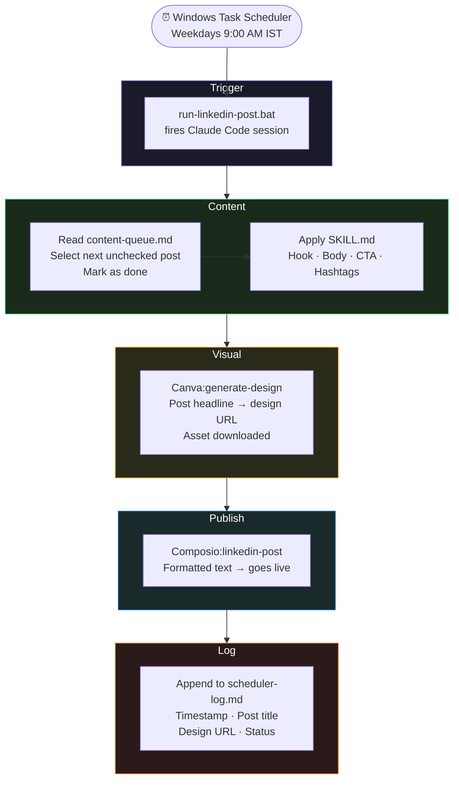

<!-- ████████████████████████████████  HEADER  ████████████████████████████████ -->

<div align="center">


</div>

<!-- ████████████████████████████████  TYPING  ████████████████████████████████ -->

<div align="center">

[](https://git.io/typing-svg)

</div>

<br/>

<!-- ████████████████████████████████  BADGES  ████████████████████████████████ -->

<div align="center">

[](https://python.org)
[](https://github.com/jlowin/fastmcp)
[](https://modelcontextprotocol.io)
[](https://canva.com)
[](.)
[](.)
[](./artifacts/README.md)

</div>

<br/>

---

<!-- ████████████████████████████████  ABOUT  ████████████████████████████████ -->

## 🧠 What This Lab Covers

```python
class ClaudeLearningLab:
    def __init__(self):
        self.author   = "Krishna Nagpal"
        self.location = "Mohali, Punjab 🇮🇳"
        self.purpose  = "End-to-end hands-on lab: MCP · Skills · Artifacts · Automation · Custom Servers"

    @property
    def chapters(self):
        return {
            "01_mcp_integrations"   : "Figma · Canva · Composio · Claude in Chrome",
            "skills"                : "SKILL.md files — consistent output across automated runs",
            "artifacts"             : "Claude-powered React apps calling Anthropic API internally",
            "04_workflows"          : "LinkedIn Post Scheduler — fully automated, 7-step pipeline",
            "05_custom_mcp_servers" : "4 FastMCP servers built from scratch",
        }

    def philosophy(self):
        return "Documentation is functional code in an agentic system."
```

---

<!-- ████████████████████████████████  MCP INTEGRATIONS  ████████████████████████████████ -->

## 🔌 MCP Integrations

### Figma MCP

<div align="center">

[](.)
[](.)

</div>

> **Key distinction:** `claude.ai` = read-only. **Claude Code** = read + write.

```bash
claude mcp add --scope user   # setup command
```

| Tool | Used For |
|:---|:---|
| `get_figma_data` | Reading design file structure |
| `download_figma_images` | Exporting assets for PPTX / DOCX scripts |
| Programmatic frame edits | Modifying frames and extracting design tokens |

---

### Canva MCP

<div align="center">

[](.)
[](.)

</div>

> **Setup:** `claude.ai Settings → Integrations`

| Tool | Used For |
|:---|:---|
| `generate-design` | Generating social post visuals |
| `generate-design-structured` | Creating structured proposal decks |
| `search-designs` | Finding existing Canva assets |
| `export-design` | Downloading final assets |
| `perform-editing-operations` | Programmatic design edits |
| `upload-asset-from-url` | Injecting assets into the LinkedIn automation pipeline |

---

### Composio MCP — LinkedIn + Instagram

<div align="center">

[](.)
[](.)

</div>

> **Setup:** `claude.ai Settings → Integrations → Composio`

| Tool | Used For |
|:---|:---|
| `linkedin-post` | Publishing layer in the post scheduler |
| `linkedin-get-profile` | Reading profile data |
| `instagram-post` | Cross-platform publishing |

> Claude generates content → Composio publishes it. **Zero manual copy-paste.**

---

### Claude in Chrome

<div align="center">

[](.)
[](.)

</div>

> **Setup:** Install Claude in Chrome from Chrome Web Store

| Tool | Used For |
|:---|:---|
| `navigate` · `read_page` | Web research and LinkedIn page reading |
| `get_page_text` | Extracting content for lead data |
| `javascript_tool` | DOM interaction and page scripting |
| `form_input` · `computer` | Testing form interactions on client portals |
| `find` | Element targeting across pages |

---

<!-- ████████████████████████████████  SKILLS  ████████████████████████████████ -->

## 📋 Skills

> `SKILL.md` files used in the **LinkedIn social media automation project** — the mechanism that makes output consistent across automated runs without a human in the loop.

### Skill — LinkedIn Social Post

**Encodes brand voice and post format:**

```
Hook          →  2 lines max before "see more" fold
Body          →  3–5 short paragraphs
CTA           →  Question to drive comments
Hashtags      →  3–5 relevant tags
Visual        →  Canva prompt template → generate-design (instagram_post type)
Brand colours →  #3E6AA7 / #A7C2EA
```

---

### Skill — Data Visual Post

**Triggers on stat/comparison topics:**

```
Step 1  →  web_search for supporting data
Step 2  →  Build Plotly / Chart.js chart as artifact
Step 3  →  Weave data into post copy
Step 4  →  Export chart as LinkedIn image
```

Chart types: `bar` · `line` · `donut` · `annotated stat card`

---

### Skill — Content Repurposing

**Input:** URL or pasted long-form text

**Output:** 3–5 standalone LinkedIn posts with posting order + suggested schedule

| Rule | Detail |
|:---|:---|
| No overlapping insights | Each post must cover a unique angle |
| Reading level | Suitable for non-technical founders |
| Standalone | Every post works without the others |

---

<!-- ████████████████████████████████  ARTIFACTS  ████████████████████████████████ -->

## ⚡ Artifacts

> Three single-file HTML artifacts that **call the Claude API directly from the browser** — with a built-in **BYOK (Bring Your Own Key)** flow so visitors test with their own credits. No backend, no proxy, no build step.

<div align="center">

[](./artifacts/README.md)
[](./artifacts/README.md)
[](./artifacts/README.md)

</div>

Each artifact has two sides — a **Skill Panel** (system prompt, memory design, prompt strategy) on the left, and a **Live Tool** on the right. A "See what Claude is being told →" button reveals the literal prompt being sent. The skill is visible, not just the output.

> 📖 **Full context:** see [`artifacts/README.md`](./artifacts/README.md)

---

### 1. README Generator — `readme-generator.html`

```
Input  → Project name · type · description · stack · license
           ↓
Prompt → Conditional tone routing (library/tool/api/webapp/agent)
           ↓
Output → Full GitHub-flavoured README.md
         badges · TOC · ✨ Features · 🚀 Install · 💻 Usage · tech table
```

**Theme:** Dark terminal · **System prompt:** *"senior open-source developer and technical writer"* · **Output discipline:** raw markdown only, no code fences.

[🔗 Live claude.ai project](https://claude.ai/project/019d66fd-fb9d-7040-8d77-678792e41574)

---

### 2. ATS Resume Builder — `ats-resume-builder.html`

```
Input  → Paste Job Description + raw experience + seniority
           ↓
Pass 1 → Extract top 10–15 ATS keywords from the JD
           ↓
Pass 2 → Rewrite bullets using exact keywords + quantified results
           ↓
Output → ATS-safe plain text resume (no tables, no columns)
```

**Theme:** Editorial light · **Technique:** two-pass reasoning compressed into one call · **Constraint guard:** no tables / columns / graphics — ATS can't parse them.

[🔗 Live claude.ai project](https://claude.ai/project/019d3f62-3133-718f-8a4e-b6c4f76f171e)

---

### 3. Social Post Scheduler — `social-post-scheduler.html`

```
Input  → Topic · brand voice · audience · platforms · post count
           ↓
Prompt → Per-platform tone matrix + anti-duplication constraint
           ↓
Output → Strict JSON → rendered as cards
         (LinkedIn · Twitter/X · Instagram · Threads, Mon–Fri)
```

**Theme:** Modern cards · **Technique:** structured JSON output + platform-conditional tone rules · **Rule:** *NEVER use the same copy across platforms.*

[🔗 Live claude.ai project](https://claude.ai/project/019d5271-25a5-769a-82e9-3f44e9593741)

---

### 🔑 BYOK in 10 Seconds

1. Open any `.html` file in a browser
2. Click the **"API Key"** button (top-right) — amber dot = no key, green dot = ready
3. Paste your `sk-ant-...` key → Save
4. Generate

The key is stored only in `localStorage` and sent **directly** to `api.anthropic.com`. Nothing is logged, proxied, or shared. Full details in [`artifacts/README.md`](./artifacts/README.md).

---

<!-- ████████████████████████████████  WORKFLOWS  ████████████████████████████████ -->

## ⚙️ Automated Workflows

### LinkedIn Post Scheduler — End-to-End



**Content queue format:** Simple markdown file — no database needed.

```markdown
[ ] Post 1: Why agentic AI is eating SaaS
[x] Post 2: What I learned building MCP servers
[ ] Post 3: The unsexy truth about automation ROI
```

> `[ ]` = pending · `[x]` = posted

**Key learning:** Claude Code is a fully scriptable CLI. MCP tool chaining (`Canva → Composio`) works reliably within a single session. `SKILL.md` is what makes output consistent across automated runs.

---

<!-- ████████████████████████████████  CUSTOM MCP SERVERS  ████████████████████████████████ -->

## 🔧 Custom MCP Servers

> Built from scratch using **FastMCP** (Python). Full documentation in [`MCP-servers-build/`](./MCP-servers-build/).

### Server 01 — SQLite Local MCP Client

<div align="center">

[](.)
[](.)

</div>

| Tool | Operation |
|:---|:---|
| `add_data(query)` | INSERT into SQLite |
| `read_data(query)` | SELECT from SQLite |

> **Learning:** The tool docstring is the routing signal. Change the docstring, change when Claude calls it. **Documentation is functional code in an agentic system.**

---

### Server 02 — Agentic RAG MCP

<div align="center">

[](.)
[](.)

</div>

| Tool | Operation |
|:---|:---|
| `vector_db_search(query)` | Queries Qdrant collection of AI/ML FAQs |
| `web_search_fallback(query)` | DuckDuckGo top 3 results |

> **Learning:** Agentic routing is docstring design. No routing code needed — the LLM reads both descriptions and decides. *"Use this for AI/ML questions"* vs *"Use this for everything else."*

---

### Server 03 — Synthetic Data Generator

<div align="center">

[](.)
[](.)

</div>

| Tool | Operation |
|:---|:---|
| `sdv_generate(folder)` | Trains `HMASynthesizer` on CSVs + `metadata.json` |
| `sdv_evaluate(folder)` | Quality score vs real data |
| `sdv_visualize(folder, table, column)` | Distribution plot PNG |

> **Learning:** Keep `server.py` thin. Business logic in `tools.py`, MCP interface in `server.py`. Easier to test, extend, and swap libraries without touching the protocol layer.

---

### Server 04 — Audio Analysis Toolkit

<div align="center">

[](.)
[](.)

</div>

| Tool | Operation |
|:---|:---|
| `transcribe_audio(path)` | AssemblyAI with summarization · sentiment · speaker labels · topic detection |
| `get_audio_data(summary, speakers, sentiment, topics)` | Returns requested insights from stored transcript |

> **Learning:** `stdio` = Claude Desktop spawns the server as a subprocess (no port needed). `SSE` = server runs independently at a URL (multi-client capable).
> **Rule: Claude Desktop → stdio. Cursor / remote → SSE.**

---

<!-- ████████████████████████████████  TRANSPORT DECISION  ████████████████████████████████ -->

## 🗺️ Transport Decision Guide

<div align="center">

| Scenario | Transport | Reason |
|:---|:---:|:---|
| Claude Desktop integration | **stdio** | Desktop app spawns server as child process — no port needed |
| Cursor / IDE integration | **SSE** | Server runs independently at a URL — multi-client capable |
| Custom agent / LlamaIndex | **SSE** | Client connects to long-lived server process |
| Local dev / debugging | **SSE** | Persistent server easier to inspect and restart independently |

</div>

---

<!-- ████████████████████████████████  REPO STRUCTURE  ████████████████████████████████ -->

## 🗂️ Repository Structure

```
Claude-Learning/
├── README.md                       ← you are here
│
├── 01-mcp-integrations/
│   ├── figma-mcp/
│   ├── canva-mcp/
│   ├── composio-mcp/
│   └── claude-in-chrome/
│
├── skills/
│   ├── linkedin-social-post.md     ← brand voice · hook/body/CTA format · Canva prompt
│   ├── data-visual-post.md         ← web_search → chart → copy flow
│   └── content-repurposing.md      ← URL/text → 3–5 standalone posts
│
├── artifacts/                      ← see artifacts/README.md for full context
│   ├── README.md                   ← public-facing artifact docs
│   ├── showcase-guide.md           ← private publishing playbook
│   ├── readme-generator.html       ← single-file BYOK tool · dark terminal theme
│   ├── ats-resume-builder.html     ← single-file BYOK tool · editorial light theme
│   └── social-post-scheduler.html  ← single-file BYOK tool · modern card theme
│
├── 04-workflows/
│   ├── content-queue.md            ← [ ] pending · [x] posted
│   ├── scheduler-log.md            ← timestamp · post title · design URL · status
│   └── run-linkedin-post.bat       ← Task Scheduler entry point
│
└── MCP-servers-build/              ← 4 FastMCP custom servers (see its own README)
    ├── 01-local-mcp-client/
    ├── 02-agentic-rag-mcp/
    ├── 03-synthetic-data-generator/
    └── 04-audio-analysis-toolkit/
```

---

<!-- ████████████████████████████████  TECH  ████████████████████████████████ -->

## 🛠️ Tech Stack

<div align="center">

[](.)

| Tool / Library | Role |
|:---|:---|
| **FastMCP** | Custom MCP server framework |
| **Composio** | LinkedIn + Instagram publishing via MCP |
| **Canva MCP** | Visual generation and design management |
| **AssemblyAI** | Audio transcription + NLP insights |
| **Qdrant** (in-memory) | Vector search in RAG server |
| **sentence-transformers** | Embedding generation for RAG |
| **SDV HMASynthesizer** | Hierarchical synthetic data generation |
| **Claude Code** | Scriptable CLI — entry point for automated workflows |
| **Windows Task Scheduler** | Cron equivalent — fires the LinkedIn pipeline daily |
| **Anthropic API** | Direct browser calls from artifacts (BYOK — `x-api-key` + `anthropic-dangerous-direct-browser-access`) |
| **Vanilla HTML/CSS/JS** | Artifact UI — single-file, zero-dependency, no build step |
| **plotly / Chart.js** | Data visualization in Skill 2 posts |

</div>

---

<!-- ████████████████████████████████  FOOTER  ████████████████████████████████ -->

<div align="center">


**Krishna Nagpal** · AI Engineer · Mohali, Punjab

[](https://github.com/Dazuka-n)
[](https://www.linkedin.com/in/krishna-161722321)
[](https://modelcontextprotocol.io)

> *"Documentation is functional code in an agentic system."*

⭐ Star this repo if it helped you build with Claude!

</div>
