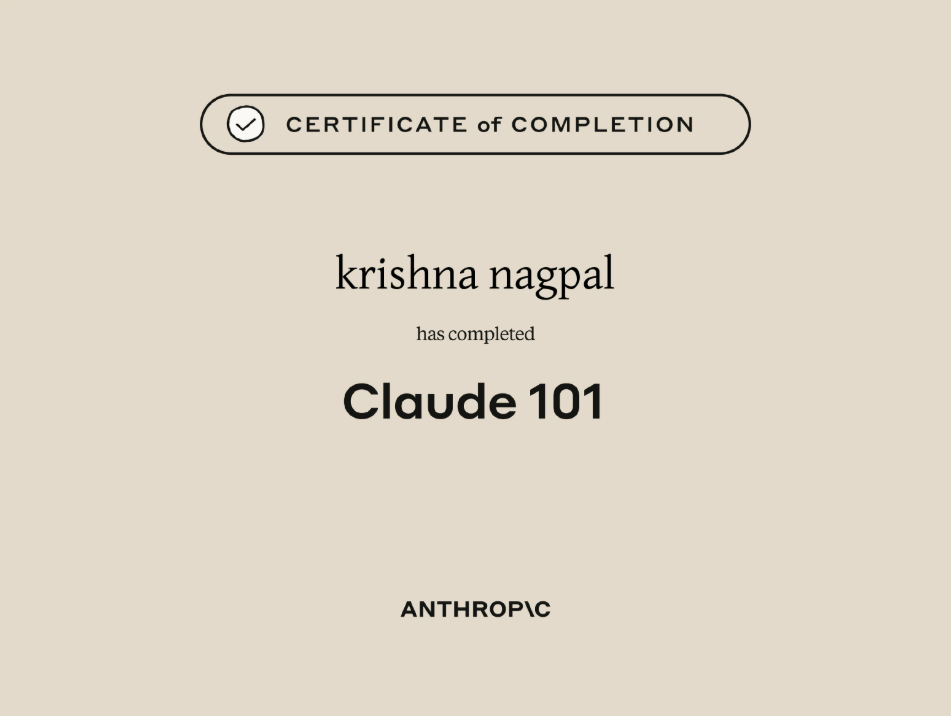
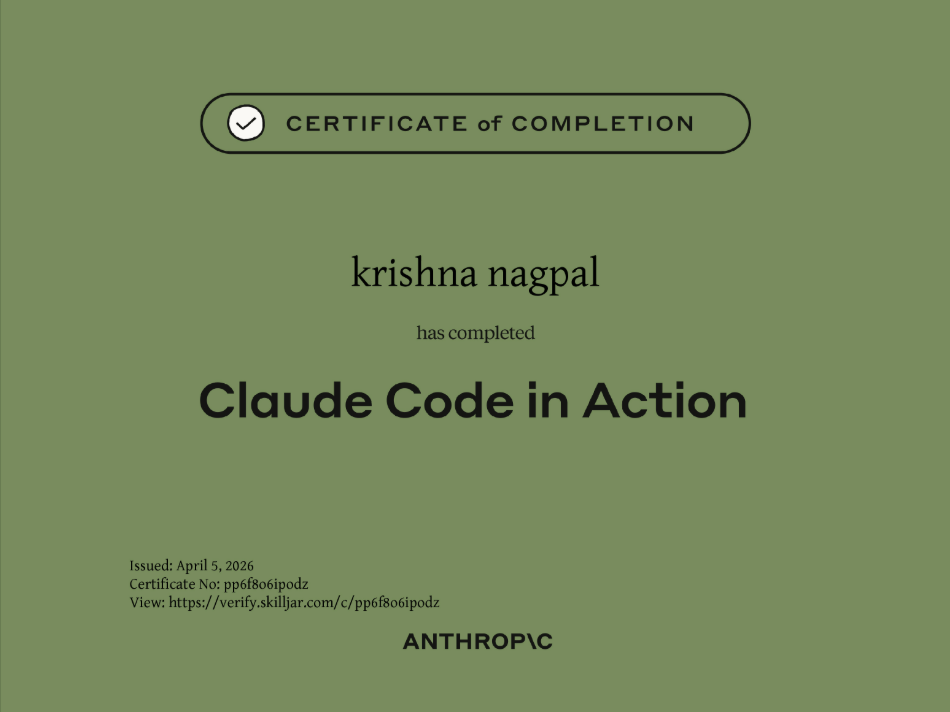
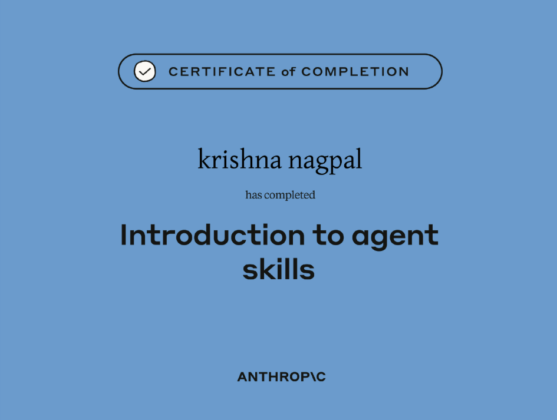
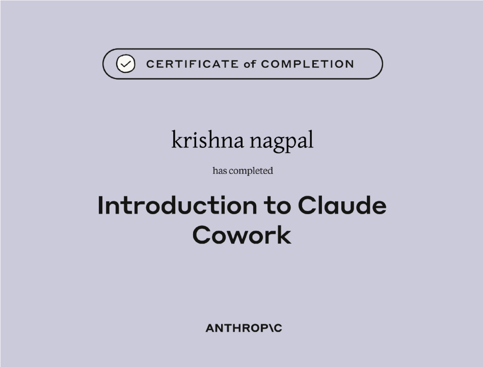
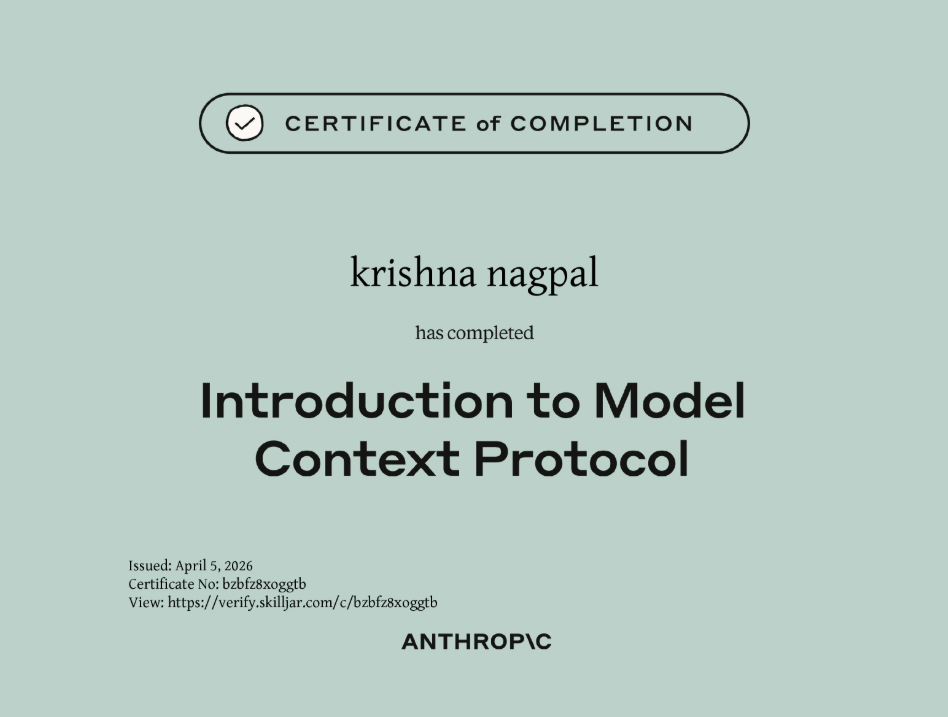
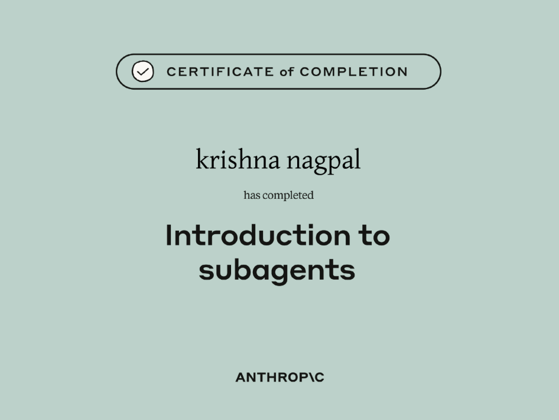

# Certificates — Anthropic / Claude Learning

Certificates of completion issued by **Anthropic** for the Claude learning curriculum.

---

<table>
<tr>
<td width="50%" align="center">

**Claude 101** · [Verify ↗](https://verify.skilljar.com/c/hkqcwrqv8hbu)

</td>
<td width="50%" align="center">

**Claude Code in Action** · [Verify ↗](https://verify.skilljar.com/c/pp6f8o6ipodz)

*Issued: April 5, 2026*

</td>
</tr>
<tr>
<td width="50%" align="center">

**Introduction to Agent Skills** · [Verify ↗](https://verify.skilljar.com/c/wwh8dachdk4c)

</td>
<td width="50%" align="center">

**Introduction to Claude Cowork** · [Verify ↗](https://verify.skilljar.com/c/4cys2qppchfx)

</td>
</tr>
<tr>
<td width="50%" align="center">

**Introduction to Model Context Protocol** · [Verify ↗](https://verify.skilljar.com/c/bzbfz8xoggtb)

*Issued: April 5, 2026*

</td>
<td width="50%" align="center">

**Introduction to Subagents** · [Verify ↗](https://verify.skilljar.com/c/5c4yicjfu2fq)

</td>
</tr>
</table>

---

| Certificate | Issued | Verify |
|:---|:---:|:---|
| Claude 101 | — | [verify.skilljar.com/c/hkqcwrqv8hbu](https://verify.skilljar.com/c/hkqcwrqv8hbu) |
| Claude Code in Action | April 5, 2026 | [verify.skilljar.com/c/pp6f8o6ipodz](https://verify.skilljar.com/c/pp6f8o6ipodz) |
| Introduction to Agent Skills | — | [verify.skilljar.com/c/wwh8dachdk4c](https://verify.skilljar.com/c/wwh8dachdk4c) |
| Introduction to Claude Cowork | — | [verify.skilljar.com/c/4cys2qppchfx](https://verify.skilljar.com/c/4cys2qppchfx) |
| Introduction to Model Context Protocol | April 5, 2026 | [verify.skilljar.com/c/bzbfz8xoggtb](https://verify.skilljar.com/c/bzbfz8xoggtb) |
| Introduction to Subagents | — | [verify.skilljar.com/c/5c4yicjfu2fq](https://verify.skilljar.com/c/5c4yicjfu2fq) |

---

*Issued to: Krishna Nagpal · [Claude Learning Lab](../)*
